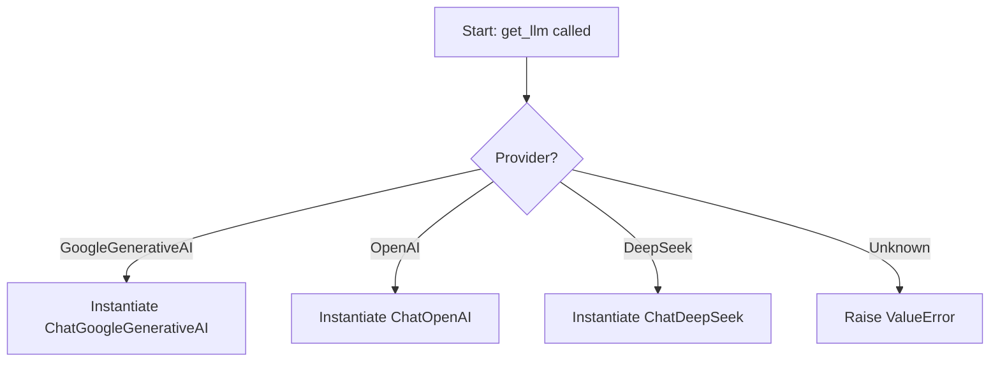
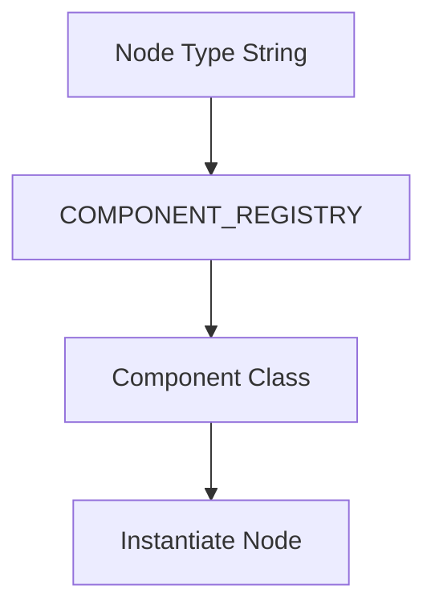

# Helper Utilities Documentation

This document describes the helper utilities used in the modular, node-based AI flow builder system. It covers the LLM provider registry, environment variable resolution, and the component registry. Diagrams are provided using Mermaid syntax for clarity.

---

## Table of Contents
- [LLM Provider Registry](#llm-provider-registry)
- [Environment Variable Resolution](#environment-variable-resolution)
- [Component Registry](#component-registry)
- [Extensibility](#extensibility)
- [Mermaid Diagrams](#mermaid-diagrams)

---

## LLM Provider Registry

The `get_llm` function provides a unified interface to instantiate different Large Language Model (LLM) providers based on configuration. Supported providers include Google Generative AI, OpenAI, and DeepSeek. The function is easily extensible for new providers.

---

## Environment Variable Resolution

The `resolve_env_var` utility allows configuration values to reference environment variables using the `env:` prefix. This supports secure and flexible configuration management.

**Function:**
```python
def resolve_env_var(value: str) -> str:
    if value.startswith("env:"):
        return os.getenv(value.split("env:")[1])
    return value
```

---

## Component Registry

The `COMPONENT_REGISTRY` is a modular, class-based registry mapping node types to their implementation classes. This enables dynamic instantiation and extensibility for new node types.

**Registry Structure:**
```python
COMPONENT_REGISTRY = {
    "input_node": InputComponent,
    "agent_node": AgentComponent,
    "output_node": OutputComponent,
}
```

---

## Extensibility

- **Adding a New LLM Provider:**
  - Import the provider’s class.
  - Add a new `elif` block in `get_llm` for the provider.
- **Adding a New Component:**
  - Implement the component class.
  - Register it in `COMPONENT_REGISTRY` with a unique key.

---

## Mermaid Diagrams

### LLM Provider Selection Flow


### Component Registry Lookup


---

## File Location
- This documentation is located at `docs/HELPER-UTILS.md`.
