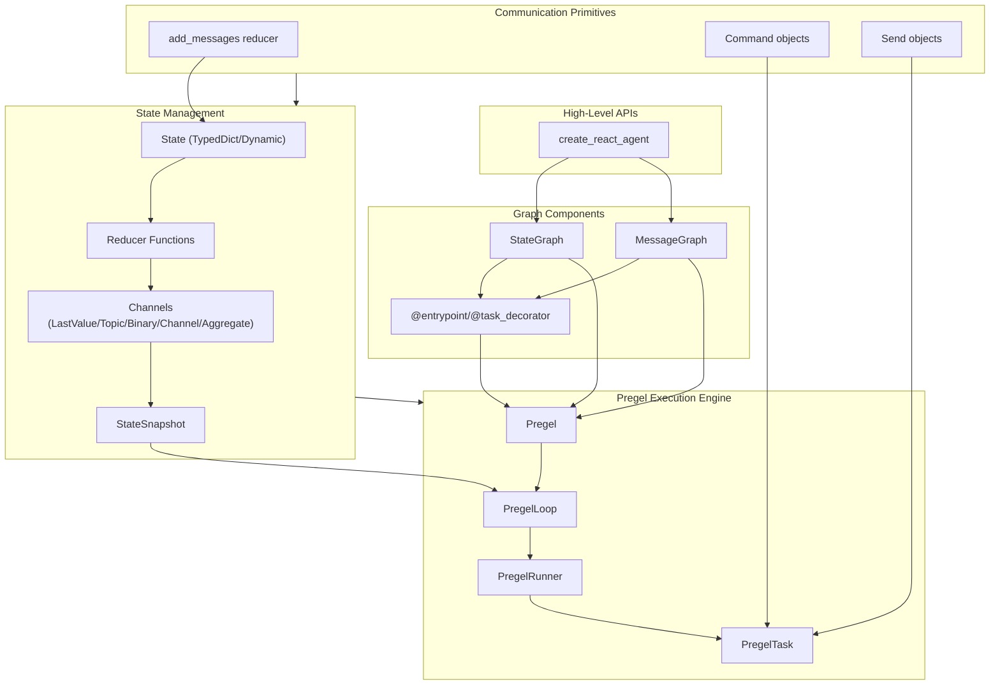

### Component Schema JSON:
Component registry is defined in `component_schema.json`. This is used for both LangGraph conversion and frontend UI rendering.

### Always consider the below LangGraph core files when responding:
- `state.py` – defines State type and state transitions
- `graph.py` – defines conversion from JSON to LangGraph `StateGraph`

### Note:
The below diagram is langgraph's core architecture

ensure that the same information is provided as text in this prompt or in a markdown file.